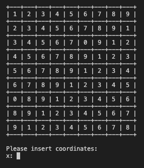

<h1 align="left">
  <br>
  Sudoku
  <br>
</h1>

<h4 align="left">Console sudoku game</h4>

<p align="left">
  <a href="#key-features">Key Features</a> •
  <a href="#how-to-play">How To Play</a> •
  <a href="#download">Download</a> •
  <a href="#requirements">Requirements</a>
</p>

<p align="left"></p>

## Key Features

- separates game logic from user interface and game controller
- replacable UI
- replacable game board provider
- uses JUnit and AssertJ for unit testing
- uses Gradle for project management
- formatted using clang-format
- automatic documantation generated using Javadoc

## How To Play

In order to play in console run
```bash
java -jar <path_to_downloaded_jar>
```

## Download

You can download latest release from <a href="https://github.com/iungomadre/sudoku/releases/">here</a>

## Requirements
You need to have following packages installed in order to run the app:
- Java 18
